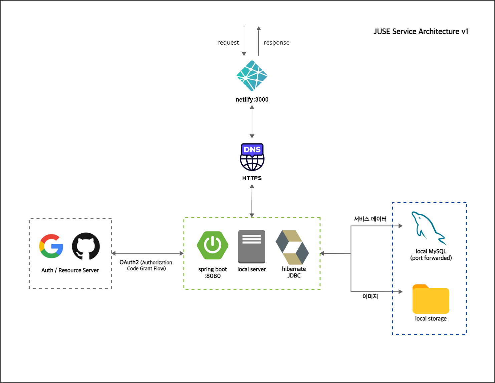
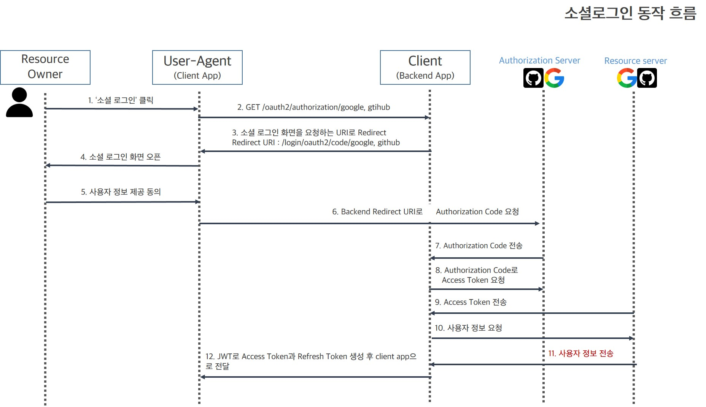
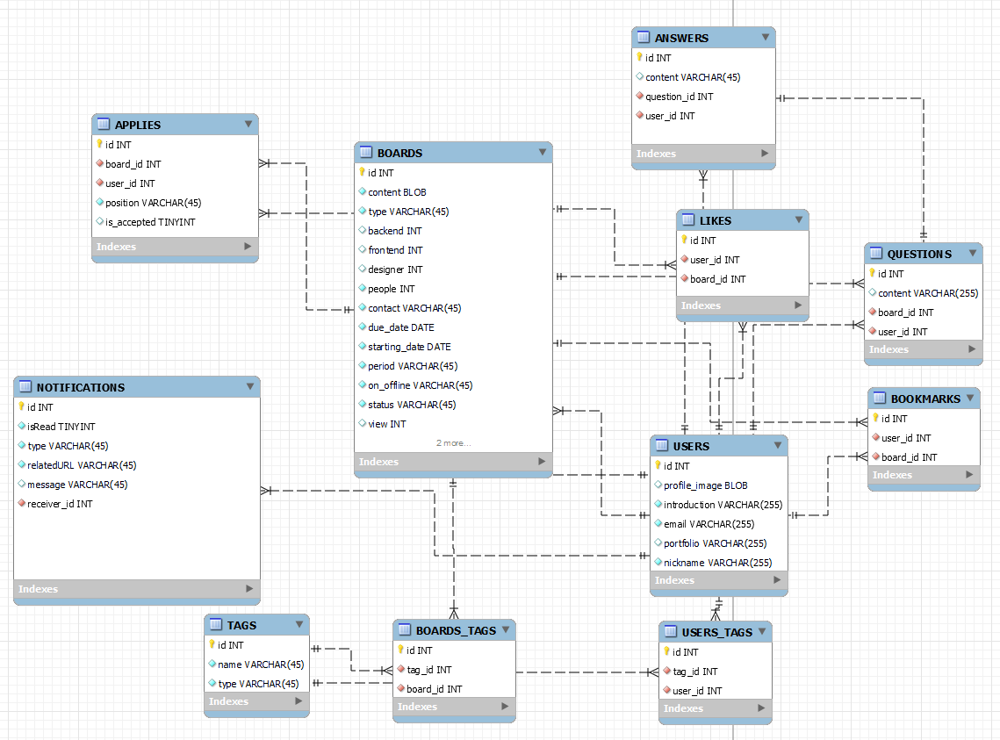
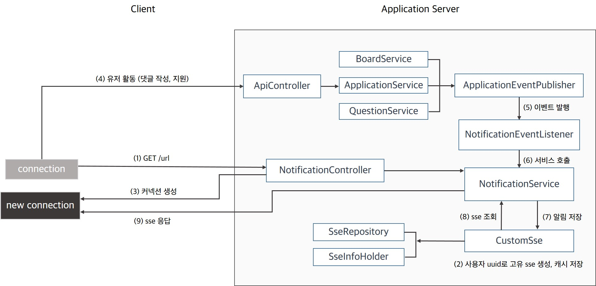
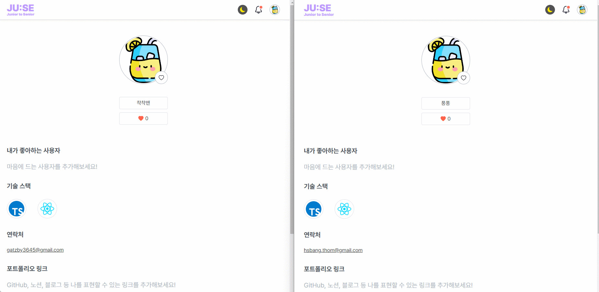

# JUSE

**JU**nior에서 **SE**nior가 될때까지, 그리고 그 뒤에도.


## 👨‍👧프로젝트 소개

### 개발자를 위한 프로젝트/스터디 모집 플랫폼, [JUSE](https://chicken-milktea-juse.com/)

좋은 소프트웨어 엔지니어가 되기 위해서는 주니어부터 시니어가 되기까지, 또한 시니어가 되어서도 학습과 고민을 멈추어선 안된다고 생각합니다.

그러나 방대한 지식을 혼자 습득 하는 것은 어려울 수 있습니다. 같은 목적을 가진 사람들과 함께 한다면 더 빨리, 많이 배울 수 있다고 생각한 것이 JUSE의 출발점입니다.
</br>

> 개발 기간: 2022.09.07 - 2022.10.12 (5주, 팀 프로젝트), v1.1 ~ v1.3 </br>
> 추가 개발: 2022.11.01 - 현재 (개인 프로젝트), 2.1.1 ~ 
</br>

v1.x는 프로젝트 기간 내에 프론트, 백엔드 팀이 함께 작업한 버전입니다.
</br>
v2.x는 프로젝트 기간 이후 개인적으로 추가 작업을 실시한 버전입니다.


## 배포

- 현재 최신 버전: v2.1.6
- 배포 버전 별 내역은 [wiki](https://github.com/thom-droid/milktea-juse/wiki) 또는 [releases](https://github.com/thom-droid/milktea-juse/releases)에서 확인할 수 있습니다.

## 서버 구성

### v1.x
<details>
<summary> 상세보기 </summary>


클라이언트는 Netlify를 통해 배포하여 https 통신을 구현하였습니다. github repository와 연동하여 특정 브랜치에 push될 때 빌드하여 배포되도록 설정되었습니다.
</br>
</br>
백엔드 서버는 애플리케이션 서버와 DB, 이미지 서버 모두 여분의 데스크탑에서 온프레미스로 구성하였으며, 포트 포워딩을 통해 외부와 통신이 가능하도록 설정하였습니다.
</br>
</br>
HTTPS 통신을 하기 위해 무료 도메인 및 SSL 인증서를 제공하는 서비스를 이용하여 클라이언트 서버와 통신이 가능하도록 구성하였습니다.
</details>


### v2.x.x

v2부터는 클라우드 서비스로 서버 구성이 변경되었습니다. 


클라이언트 서버는 빌드된 코드를 static web server 역할을 하는 버킷에 배포합니다. 이 버킷은 CloudFront 서비스를 통해 오리진으로 설정하였고, 
캐싱된 사본은 엣지인 CloudFront에서 관리하며 클라이언트로 요청이 들어왔을 때 이 캐시가 사용됩니다. CloudFront는 https 로 통신하도록 설정되었습니다.
</br>
</br>
백엔드 서버는 애플리케이션이 동작하고 있는 EC2 인스턴스 앞에 ALB를 두고 있으며, ALB는 https 통신을 하도록 설정되어있으므로 서버로 들어오는 요청을 필터링하는 프론트 프록시 역할을 하게 됩니다
(현재 버전에서는 인스턴스 내 애플리케이션은 하나만 설정되어 있어 리버스 프록시 기능은 하고 있지 않습니다).
</br>
</br>
EC2에서 실행되는 spring boot 애플리케이션과는 http 통신을 진행합니다. DB는 RDS MySQL을 사용하였습니다. 
</br>
</br>
Route53 서비스를 통해 들어온 요청을 설정된 주소에 맞게 라우팅합니다. 
클라이언트 서버로 들어온 요청은 CloudFront로, 백엔드 서버로 보내는 요청은 ALB로 각각 라우팅합니다. 
도메인을 AWS가 아닌 외부에서 구입하였으므로, 도메인 주소로 들어온 요청은 AWS 리소스로 라우팅 되도록 네임서버를 설정하였습니다.
</br>
</br>

### CI/CD
Github 레포지토리의 main 브랜치에 push 작업이 발생했을 경우 Github Actions을 통해 main 브랜치에 있는 소스 코드를 테스트, 압축 및 빌드하고, CodeDeploy 가 AWS 서비스에 압축 파일 및 빌드 결과물을 전달하도록 스크립트를 실행합니다. 
이 때 압축 파일은 버저닝을 위해 S3 버킷에 저장하고, 빌드된 파일은 EC2로 전달합니다. 
EC2에서 실행 중인 자바 프로세스를 확인하고, 있으면 종료 시킨 뒤 새로 전달받은 빌드를 실행시킵니다.
</br>
</br>

### 소셜 로그인
OAuth2에 기반하여 Github과 Google에 인증 작업을 위임합니다. 
EC2 인스턴스에서 실행되는 애플리케이션에서 작업을 요청하게 되며 이 때 채택된 방식은 Authorization Code Grant 입니다. 아래는 JUSE에서 소셜 로그인이 진행되는 흐름입니다.
</br>
</br>


클라이언트 앱(리액트 앱)에서 유저 정보 동의를 얻으면 백엔드 앱(스프링 앱)으로 지정된 주소로 요청을 보냅니다.
</br>
</br>
스프링에서는 구글, 깃헙의 인가 서버에 설정해놓은 리다이렉션 URI로 인가 코드를 요청하고, 이 코드를 통해 실제 유저 정보를 가지고 있는 구글, 깃헙의 리소스 서버에 접근할 수 있는 접근 토큰을 얻어옵니다.
</br>
</br>
이 토큰을 통해 지정된 범위만큼의 정보(이메일, 프로필 사진 주소 등)를 리소스 서버에서 얻어옵니다. 정보를 얻어오는 데 성공하면 JWT를 발급하여 프론트로 전달합니다.
</br>
</br>

## 프로젝트 구조

MVC 패턴과 레이어드 아키텍처를 활용한 모놀리식 구조를 가지고 있습니다. 
</br>
</br>
모든 컴포넌트가 하나의 애플리케이션 내부에 포함되어 있으므로 코드 간의 종속성이 높지만, 유지보수와 테스트, 디버깅, 배포가 비교적 수월하다는 장점이 있습니다. 전통적인 웹 개발 방식이므로 레퍼런스가 풍부하고, 트래픽이 많지 않은 프로젝트에 도입하기 적합하였습니다.    
</br>

## DB 



외래키를 통해 N:1, N:M 등의 테이블의 관계를 표현하였고, 팀원과의 논의를 통해 정규화를 적용하였습니다. 
</br>
</br>
프로젝트 초반 단계에서는 h2 와 hibernate 설정으로 스키마를 자동 생성되도록 하여 동작 여부를 확인하였습니다. 실제 개발 단계에서는 MySQL workbench를 통해 스키마를 작성한 뒤 로컬 서버를 통해 작업하였습니다.
</br>
</br>

### 트랜잭션 관리
Spring에서 지원하는 어노테이션 기반으로 트랜잭션을 관리하였습니다. MySQL 8.0의 기본엔진인 InnoDB의 디폴트 설정(repeatable read)를 사용하였습니다. 각 트랜잭션에 식별 번호를 부여하여 해당 트랜잭션이 작업하고 있는 레코드가 다른 트랜잭션에 영향을 미치지 않습니다.   
</br>
#### 동기 작업

서비스 레이어에서 트랜잭션들의 순서를 지정하고 하나의 트랜잭션으로 처리하기 위한 작업에 사용하였습니다.
</br>
</br>
`@Transactional`의 기본설정인 `Propagation.REQUIRED` 를 통해 해당 메서드에 포함되어 있는 작업들이 한 스레드로 묶여 하나의 트랜잭션으로 수행됩니다 (직접 설정한 객체 그래프나 DTO가 아닌 JPA 프록시 객체를 사용하는 경우에도 세션 유지가 필요하므로 설정해준 부분도 있습니다).
</br>
</br>
따라서 해당 메서드를 실행 중 예외가 발생하게 되면 커밋이 되지 않고 롤백이 됩니다 (롤백 정책은 `@Transactional`의 기본 설정을 사용하였습니다). 

```java
public class BoardServiceImpl {
    
    private final UserService userService;
    private final TagService tagService;
    private final BoardReopsitory boardReopsitory;
    
    // constructor
    
    @Transactional
    public Board create(Board post){
        User user = userService.verifyByUser(post.getUser());
        Tag tag = tagService.verifyByTagName(post.getTagName());
        return boardReopsitory.save(post);
    }    
}

```
<br>

#### 비동기 작업 (이벤트 처리)
특정 작업 후 알림이 발행되는 이벤트의 경우 앞의 작업이 완료된 후 실행되어야 하고, 알림 발행 자체가 동기적으로 진행될 필요가 없으므로 트랜잭션이 커밋된 후 비동기 스레드로 응답하도록 설정하였습니다.

```java
@Service
public class ApplicationServiceImpl implements ApplicationService {
    
    @Override
    @Transactional
    public Appilcation create(Application obj) {
        
        // ... obj 유효성 검증 코드
        
        // 알림 객체 생성 및 엔티티 persist
        Notification notification = Notification.of(Type.NEW_APPLICATION, obj.getUser(), obj.getUrl());
        Application application = applicationRepository.save(obj);
        
        // 이벤트 발행
        eventPublisher.publishEvent(new NotificationEvent(this, notification));
        
        return application;
    }
}

@EnableAsync
@Component
public class NotificationEventListener {
    
    private final NotificationService notificationService;
    
    // 트랜잭션 커밋 후 비동기 스레드에서 처리 및 응답
    @Async
    @TransactionalEventListener(phase = TransactionPhase.AFTER_COMMIT)
    public void handleNotificationEvent(NotificationEvent event) {
        Notification notification = event.getEvent();
        notificationService.send(notification);
    }
}
```
<br>
<br>

## 예외 처리

Spring AOP에서 지원하는 `@RestControllerAdvice`를 통해 스프링 컨테이너 내 핸들러 메서드를 호출하면서 발생한 런타임 예외를 에스팩트로 간주하고 처리합니다. 
`@RestControllerAdvice`는 모든 컨트롤러에 어드바이스로 적용되는 `@ControllerAdvice`의 응답을 `@ResponseBody`를 통해 json으로 작성할 수 있도록 해줍니다.
따라서 애플리케이션 관점에서 다른 컨트롤러 메서드와 같이 일관적인 응답 작성이 가능해집니다. 이 때 응답의 내용은 `ExceptionResponse`를 통해 채워집니다. 
</br>
</br>
컨트롤러 어드바이스에서 감지한 예외는 그 예외의 타입에 따라 `@ExceptionHandler`를 통해 처리됩니다. 
해당 애플리케이션에서는 핸들러 메서드의 아규먼트가 잘못되었거나, 입력된 값이 엔티티 유효성 검사를 통과하지 못하거나, 저희가 지정한 커스텀 예외가 발생한 경우를 처리하도록 지정하였습니다. 
</br>
</br>
 

``` java
@RestControllerAdvice
public class GlobalExceptionAdvice {

    @ExceptionHandler(CustomRuntimeException.class) // 커스텀 예외 발생 처리 
    public ExceptionResponse handleCustomRuntimeException(CustomRuntimeException customRuntimeException) {

        return ExceptionResponse.of(customRuntimeException);
    }

    @ExceptionHandler(MethodArgumentNotValidException.class) // 잘못된 컨트롤러 메서드 인자로 발생한 예외 처리
    @ResponseStatus(HttpStatus.BAD_REQUEST)
    public ExceptionResponse handlerMethodArgumentNotValidException(MethodArgumentNotValidException exception) {

        return ExceptionResponse.of(exception.getBindingResult());
    }

    @ExceptionHandler(ConstraintViolationException.class) // 엔티티 유효성 검사에 실패했을 때 예외 처리
    @ResponseStatus(HttpStatus.INTERNAL_SERVER_ERROR)
    public ExceptionResponse handlerConstraintViolationException(ConstraintViolationException exception) {

        return ExceptionResponse.of(exception.getConstraintViolations());
    }
}

```
<br>
<br>


## 테스트

테스트는 필요에 따라 유닛 테스트, 슬라이스, 통합 테스트를 진행하였습니다.

`@TestComponent`와 `@TestPropertySource`를 활용하여 테스트에서만 필요한 환경을 설정하여 어떤 환경에서도 동작할 수 있도록 하였습니다.

```java
@RecordApplicationEvents
@TestPropertySource(locations = {"/application.properties", "/application-oauth-local.properties"})
@Import(TestDBInstance.class)
@SpringBootTest
@AutoConfigureMockMvc
class ApplicationControllerTest {

    @Autowired
    MockMvc mockMvc;

    @Autowired
    private ApplicationRepository applicationRepository;

    @Autowired
    private NotificationRepository notificationRepository;

    @Test
    public void test(){
        //...
    }
}

@RequiredArgsConstructor
@TestConfiguration
public class TestDBInstance {
    
    private final UserRepository userRepository;
    
    @Bean
    public void populate(){
        User user = User.builder().email("test1").build();
        userRepository.save(user);
    }
}

```
</br>

테스트하고자 하는 기능에 집중하기 위해 mockito를 통해 필요 없는 의존성은 mocking 하여 테스트하였습니다.
실제 메서드가 호출 될 때 mocking 객체가 이를 가로채 사용자가 지정한 메서드를 수행합니다.  

```java
@ExtendWith(MockitoExtension.class)
@AutoConfigureMockMvc
@ContextConfiguration(classes = {UserServiceImpl.class})
@SpringBootTest
public class UserServiceTest {

    @MockBean
    private StorageSevice storageSevice;
    
    @MockBean
    private TagService tagService;
    
    @MockBean
    private UserRepository userRepository;
    
    @Test
    public void givenMultipartFile_whenUserCreated_thenSuccess() throws IOException {
        
        given(storageService.store(Mockito.any(MultipartFile.class))).willReturn("savedFileName");
        given(tagService.findByName(Mockito.anyString())).willReturn(Mockito.mock(Tag.class));
        given(userRepository.save(Mockito.any(User.class))).willReturn(testUser);

        //when
        User createdUser = userService.createUser(testUser, mockMultipartFile);

        //then
        assertEquals(testUser.getImg(), createdUser.getImg());
        assertEquals(testUser.getMyImg(), createdUser.getMyImg());
    }
}

```

<br>


스프링 컨텍스트틑 사용하여야 하더라도 `@ContextConfiguration`을 통해 필요한 컨텍스트만 로드하여 테스트 오버헤드를 줄일 수 있도록 했습니다.

```java
@ContextConfiguration(classes = AppKeyConfig.class)
@SpringBootTest(properties = "jwt.secret=${random.uuid}")
public class AppKeyConfigTest {

    @Autowired
    SecretKeyHolder secretKeyHolder;

    @Test
    public void JwtSecretKeyFinal() {
        String key = secretKeyHolder.getSecretKey();
        String key2 = secretKeyHolder.getSecretKey();

        Assertions.assertEquals(key, key2);
    }
}
```
<br>


## 실시간 알림 기능
실시간 정보를 표현하기 위해 일반적인 polling 방식을 사용한다면, 지속적으로 서버에 업데이트된 정보가 있는지 확인하는 요청을 보내야 합니다. 
이 때 업데이트된 정보가 없을 경우 빈 응답이 돌아오게 되므로, 요청을 수행하기 위한 커넥션 연결과 요청 데이터 등과 같은 자원의 낭비가 발생합니다.
또한 api 관점에서 볼 때, 알림 기능은 서버에서 업데이트된 정보만 전달하면 되므로 알림 서버에서 클라이언트 서버로의 단방향 통신을 하는 push api 방식이 필요하다고 생각했습니다.
<br>
<br>
이와 같은 판단 하에 SSE(server-sent event) 방식으로 알림을 구현하였습니다. HTML5의 `EventSource` 인터페이스를 활용하여 long polling 방식으로 요청을 보내고, 애플리케이션 서버에서는 `SseEmitter` 클래스를 통해 비동기 요청을 처리하여 body로 응답하게 됩니다. 결과적으로 서버에서 특정한 이벤트가 있을 때에만 응답이 작성되어 클라이언트로 전달되게 됩니다.
<br>
<br>
`EventSource` 를 활용한 SSE 방식은 데이터 타입이 한정적이고 요청 헤더 설정이 불가능한 점 등 구현 범위가 제한적인 한계가 있습니다. 하지만 http 통신을 사용하는 환경에서 쉽고 빠르게 구현이 가능하다는 점을 고려하여 채택하였습니다.
<br>
<br>
아래는 JUSE에서 알림 서비스가 동작하는 방식을 도식화한 것입니다.

<br>


<br>

1. 클라이언트가 특정 url로 GET 요청.
2. 사용자 uuid로 고유 sse를 생성하고 생성된 id를 sse 컴포넌트의 해시맵에 캐시로 저장. 
3. 요청 결과로 새로운 커넥션 생성. 커넥션에서 비동기 요청을 보내며, 응답은 서버에서 응답이 있거나 time out이 되기 전까지 펜딩됨.
4. 유저가 알림을 발생시키는 행위를 함.
5. 각 서비스에서 `ApplicationEventPublisher` 의존성을 가지고 있으며, 비즈니스 로직 수행 후 이벤트를 발행함.
6. 비즈니스 로직이 정상적으로 수행된 뒤 이벤트가 수행되어야 하므로, 이벤트 리스너에 `@TransacationalEventListener(phase = AFTER_COMMIT)` 설정을 하여 이벤트를 발행한 트랜잭션이 커밋된 것을 확인한 후 `NotificationService` 의 메서드를 호출하도록 함. 또한 기존 요청(비즈니스 로직을 호출한 요청)에 대한 응답과 알림은 별도의 로직이므로, `@Async` 로 설정하여 알림 발송이 새로운 스레드에서 비동기적으로 수행되도록 함.
7. `NotificationService`에서 파라미터로 받은 알림을 저장.
8. 알림 수신자의 uuid로 sse id를 캐시에서 조회.
9. 조회한 sse에 알림 정보를 담아 클라이언트로 응답.
 
<br>

#### 동작 예시
- 지원자가 게시글에 지원했을 때 게시글 작성자에게 알림 발송
- 지원이 수락되었을 때 지원자에게 알림 발송





<br/>

## 💁🏻‍♀️ 팀원 소개

|                                                                                     방현수(BE 팀장)                                                                                      |                                                                               최영민(BE)                                                                                |                                                정우용(FE)                                                |                                               김은주(FE)                                               |
| :--------------------------------------------------------------------------------------------------------------------------------------------------------------------------------------: | :---------------------------------------------------------------------------------------------------------------------------------------------------------------------: | :------------------------------------------------------------------------------------------------------: | :----------------------------------------------------------------------------------------------------: |
|  |  |  |  |
|                                                                       [thom-droid](https://github.com/thom-droid)                                                                        |                                                                 [aprochoi](https://github.com/aprochoi)                                                                 |                                 [cleats01](https://github.com/cleats01)                                  |                                  [ekim49](https://github.com/ekim49)                                   |

<br/>

## 📚 기술 스택
#### Web Communication

 
</br>

#### Frontend


</br>
#### Backend


</br>


</br>


</br>

#### Tools & Collaboration


