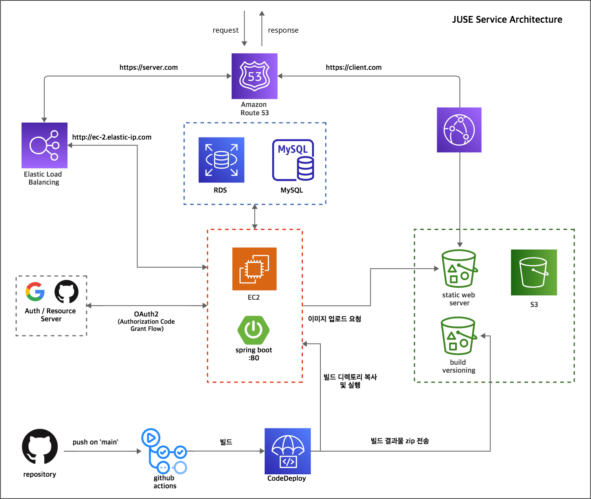

# JUSE

**JU**nior에서 **SE**nior가 될때까지, 그리고 그 뒤에도.

## 👨‍👧프로젝트 소개

### 개발자를 위한 프로젝트/스터디 모집 플랫폼, [JUSE](https://chicken-milktea-juse.com/)

좋은 소프트웨어 엔지니어가 되기 위해서는 주니어부터 시니어가 되기까지, 또한 시니어가 되어서도 학습과 고민을 멈추어선 안되겠죠.

그러나 방대한 지식을 혼자 습득 하는 것은 어려울 수 있습니다. 같은 목적을 가진 사람들과 함께 한다면 더 빨리, 많이 배울 수 있다고 생각한 것이 JUSE의 출발점입니다.
 

> 개발 기간: 2022.09.07 - 2022.10.12 (5주, 팀 프로젝트)  
> 추가 개발: 2022.11.01 - 현재 (개인 프로젝트)

 

## 배포

- 현재 최신 버전: v2.1.5
- 배포 버전 별 내역은 [release note](https://github.com/thom-droid/milktea-juse/wiki/Release-Note) 에서 확인할 수 있습니다.

## 서비스 아키텍처
v2부터는 클라우드 서비스로 서버 구성이 변경되었습니다. 로컬 환경에서의 서버 구성은 여기를 참고해주세요.

### 서버 구성
클라이언트 서버는 빌드된 코드를 static web server 역할을 하는 버킷에 배포합니다. 이 버킷은 CloudFront 서비스를 통해 오리진으로 설정하였고, 캐싱된 사본은 엣지인 CloudFront에서 관리하며 실제 요청 시 이 캐시가 사용됩니다. CloudFront는 SSL 인증서를 발급하여 https 로 통신하도록 설정되었습니다. 

백엔드 서버는 ALB를 통해 https 통신을 진행합니다. EC2에서 실행되는 spring boot 애플리케이션과는 http 통신을 진행합니다. DB는 RDS MySQL을 사용하였습니다.

Route53 서비스를 통해 들어온 요청을 설정된 주소에 맞게 라우팅합니다. 클라이언트 서버로 들어온 요청은 CloudFront로, 클라이언트에서 백엔드 서버로 보내는 요청은 ALB로 각각 라우팅합니다. 도메인을 AWS가 아닌 외부에서 구입하였으므로, 도메인 주소로 들어온 요청은 AWS 리소스로 라우팅 되도록 네임서버를 설정하였습니다.

### CI/CD
Github 레포지토리의 main 브랜치에 push 작업이 발생했을 경우 Github Actions을 통해 main 브랜치에 있는 소스 코드를 테스트, 압축 및 빌드하고, CodeDeploy 가 AWS 서비스에 압축 파일 및 빌드 결과물을 전달하도록 스크립트를 실행합니다. 이 때 압축 파일은 버저닝을 위해 S3 버킷에 저장하고, 빌드된 파일은 EC2로 전달합니다. EC2에서 실행 중인 자바 프로세스를 확인하고, 있으면 종료 시킨 뒤 새로 전달받은 빌드를 실행시킵니다.

### OAuth2 소셜 로그인
OAuth2에 기반하여 Github과 Google에 인증 작업을 위임합니다. EC2 인스턴스에서 실행되는 애플리케이션에서 작업을 요청하게 되며 이 때 채택된 방식은 Authorization Code Grant 입니다.

[이미지 첨부 필요]

## 문서

- [사용자 요구사항 정의서](https://docs.google.com/spreadsheets/d/1YQc8KwcKyAEsbhF_-LmGuVD35DMIdXNNGF-e1COYyHk/edit#gid=0)
- [화면 정의서](https://www.notion.so/67392033074049daaca51da6605c83af)
- [API documentation](https://documenter.getpostman.com/view/16361879/2s7YfGGJqm#intro)

 

## 💁🏻‍♀️ 팀원 소개

|                                                                                     방현수(BE 팀장)                                                                                      |                                                                               최영민(BE)                                                                                |                                                정우용(FE)                                                |                                               김은주(FE)                                               |
| :--------------------------------------------------------------------------------------------------------------------------------------------------------------------------------------: | :---------------------------------------------------------------------------------------------------------------------------------------------------------------------: | :------------------------------------------------------------------------------------------------------: | :----------------------------------------------------------------------------------------------------: |
|  |  |  |  |
|                                                                       [thom-droid](https://github.com/thom-droid)                                                                        |                                                                 [aprochoi](https://github.com/aprochoi)                                                                 |                                 [cleats01](https://github.com/cleats01)                                  |                                  [ekim49](https://github.com/ekim49)                                   |

 

## 📚 기술 스택

### Frontend

### Backend

### Tools & Collaboration

